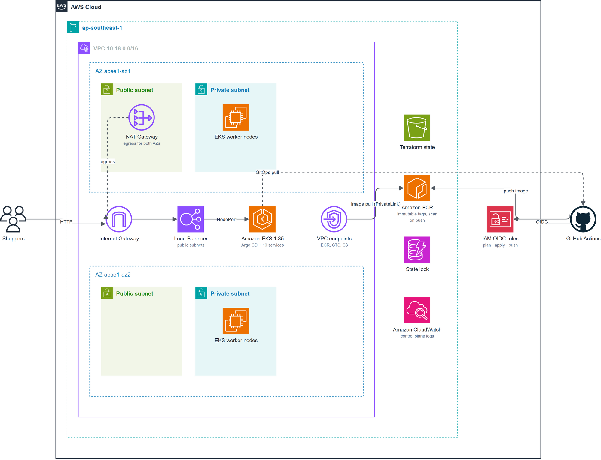
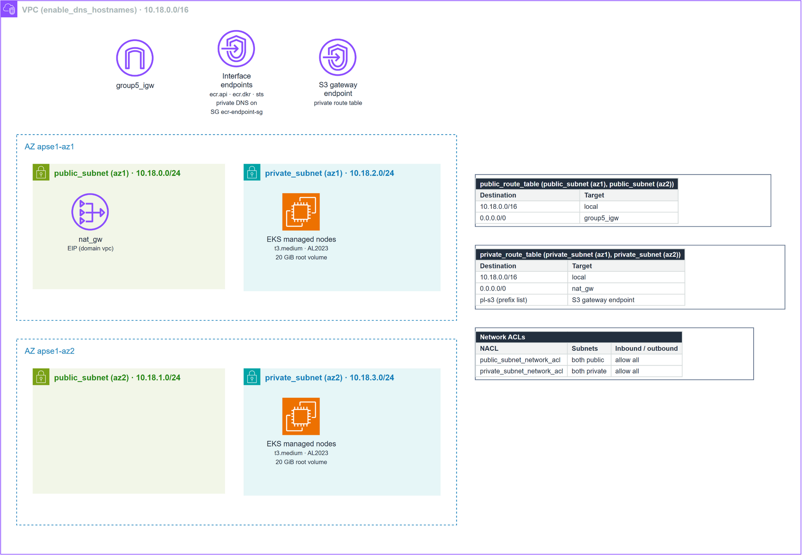
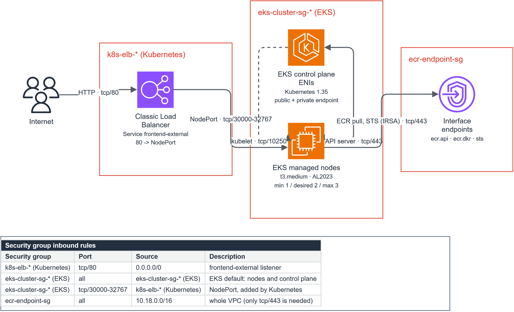
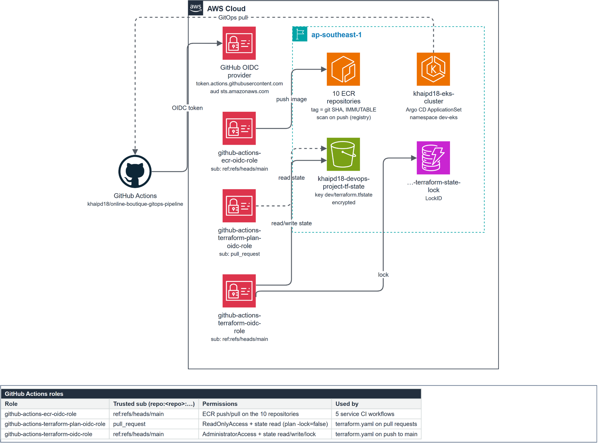
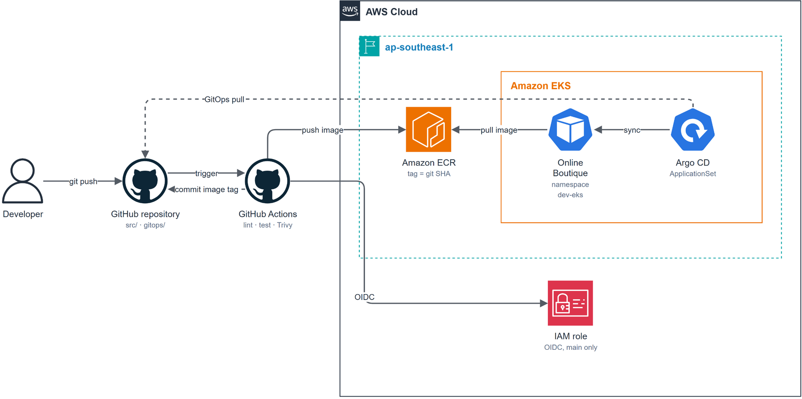
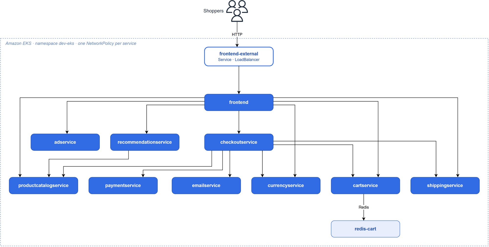

# Online Boutique on EKS: DevSecOps pipeline với Terraform, GitHub Actions và Argo CD

[English](README.md) | **Tiếng Việt**

> Mỗi lần push code, pipeline chạy lint, test, scan, rồi build image và đẩy lên ECR. CI ghi tag mới vào Git, Argo CD sync lên EKS. Repo không chứa access key AWS nào.


---

## About

Đây là dự án DevOps/DevSecOps cá nhân. Dự án lấy [Online Boutique](https://github.com/GoogleCloudPlatform/microservices-demo) của Google (một hệ thống e-commerce gồm 10 microservice viết bằng 5 ngôn ngữ Go, C#, Java, Node.js, Python, giao tiếp qua gRPC) làm nền và bổ sung hạ tầng, CI/CD, GitOps cùng các lớp bảo mật để chạy hệ thống trên AWS.

Thiết kế bám theo yêu cầu của một môi trường production: quyền tối thiểu cho pipeline, không dùng long-lived credentials, chặn cấu hình sai trước khi `apply`, quét lỗ hổng image trước khi push, và cô lập mạng giữa các service.

| | |
|---|---|
| **Vai trò** | Thiết kế và xây dựng toàn bộ hạ tầng, pipeline và cấu hình triển khai |
| **Ứng dụng** | Online Boutique (mã nguồn gốc trong `src/` được giữ nguyên) |
| **Cloud** | AWS, region `ap-southeast-1` |
| **Trọng tâm** | Infrastructure as Code, GitOps, DevSecOps, least privilege |

---

## Highlights

- **72 tài nguyên AWS** dựng hoàn toàn bằng Terraform module: VPC 2 AZ, EKS, ECR, VPC endpoints, IAM OIDC.
- **Không dùng long-lived credentials.** GitHub Actions vào AWS bằng OIDC, pod dùng IRSA. Trust policy khóa đến từng claim `sub`: chỉ `main` mới được `apply` hay push image, còn pull request chỉ được `plan` với role read-only.
- **5 CI pipeline cho 5 ngôn ngữ**, chỉ build đúng service có thay đổi nhờ path filter và dynamic matrix.
- **Security gates:** Checkov chặn Terraform cấu hình sai trước `plan`/`apply`, Trivy quét mọi image trước khi push và đẩy kết quả lên tab *Security* của GitHub kèm SBOM CycloneDX.
- **GitOps:** CI ghi git SHA của image vào `gitops/`, Argo CD ApplicationSet tự sync lên cluster và tự sửa lại mọi thay đổi tay (self-heal).
- **Pod hardening và network segmentation:** non-root, read-only root filesystem, drop mọi capability, Pod Security Admission `restricted`, NetworkPolicy chỉ mở đúng những đường gọi gRPC cần thiết.
- **Đã kiểm chứng:** checkout end-to-end chạy trọn, NetworkPolicy chặn 3/3 kết nối trái phép, lỗi Checkov trên Kubernetes manifests giảm từ **128 xuống 12** ([chi tiết](#kết-quả-kiểm-chứng)).

---

## Kiến trúc

### Hạ tầng trên AWS



Traffic từ internet đi vào qua Internet Gateway tới load balancer nằm trong public subnet, rồi được chuyển tới các EKS worker node trong private subnet ([inbound traffic path](https://docs.aws.amazon.com/prescriptive-guidance/latest/load-balancer-stickiness/subnets-routing.html)). Worker node nằm hoàn toàn trong private subnet. Traffic tới ECR, STS và S3 (nơi ECR lưu image layer) đi qua VPC endpoint, nên vừa không phải vòng qua NAT Gateway vừa không ra internet ([ECR VPC endpoints](https://docs.aws.amazon.com/AmazonECR/latest/userguide/vpc-endpoints.html)). Subnet được ghim theo AZ ID (`apse1-az1`, `apse1-az2`) vì tên AZ ánh xạ khác nhau giữa các tài khoản. Một NAT Gateway dùng chung cho cả hai AZ là đánh đổi có chủ đích để tiết kiệm chi phí ở môi trường dev.

<details>
<summary><b>Low-level design: network, security groups, CI/CD và IAM OIDC</b></summary>
<br>

**Network detail**: CIDR từng subnet, route table, VPC endpoint, NACL.



**Security group flow**: luồng traffic kèm port, bảng rule inbound của từng security group.



**CI/CD và IAM OIDC**: role nào được assume từ đâu, quyền gì, tác động lên tài nguyên nào.



File gốc chỉnh sửa được bằng draw.io: [`aws-hld.drawio`](docs/infrastructure/aws-hld.drawio), [`aws-lld.drawio`](docs/infrastructure/aws-lld.drawio). Sơ đồ được sinh từ spec YAML ([`aws-hld.spec.yaml`](docs/infrastructure/aws-hld.spec.yaml), [`aws-lld.spec.yaml`](docs/infrastructure/aws-lld.spec.yaml)) với giá trị lấy trực tiếp từ `terraform/`.
</details>

### Từ commit tới cluster



### Ai được gọi ai (NetworkPolicy)

Mỗi service chỉ nhận traffic từ đúng những service cần gọi nó, theo các mũi tên dưới đây. Mọi kết nối khác đều bị chặn.



---

## Tech stack

| Lớp | Công cụ | Phiên bản |
|---|---|---|
| Infrastructure as Code | Terraform, AWS provider | 1.14.8, 6.39.0 |
| Kubernetes | Amazon EKS, managed node group AL2023 | 1.35 |
| EKS add-ons | VPC CNI (bật network policy), CoreDNS, kube-proxy | v1.21.1, v1.13.2, v1.35.3 |
| Container registry | Amazon ECR, tag immutable, scan on push ở cấp registry | – |
| CI | GitHub Actions, `dorny/paths-filter`, composite action | – |
| Security scanning | Checkov (IaC), Trivy (image, SARIF, SBOM CycloneDX) | 3.3.22, 0.75.0 |
| Packaging | Helm (universal chart), Kustomize | – |
| CD | Argo CD ApplicationSet | stable |
| Observability | kube-prometheus-stack (Prometheus, Grafana) | 84.4.0 |

---

## Cách hệ thống hoạt động

### Infrastructure as Code

Hạ tầng chia thành các module nhỏ, mỗi module làm đúng một việc. Terraform và các workflow không hardcode account ID: Terraform tự lấy từ credentials đang dùng, còn workflow đọc từ repository variable `AWS_ACCOUNT_ID`, nên đổi sang tài khoản khác không phải sửa code. Địa chỉ image ECR trong `gitops/dev-eks/` do CI ghi vào và vẫn trỏ tới tài khoản của lần chạy EKS trước; lần đầu CI chạy ở tài khoản mới sẽ ghi đè lại.

<details>
<summary><b>Chi tiết các module Terraform</b></summary>
<br>

| Module | Tạo ra những gì |
|---|---|
| `vpc` | VPC, 2 public + 2 private subnet trên 2 AZ, Internet Gateway, NAT Gateway, route table, NACL |
| `eks` | EKS cluster (bật đủ 5 loại control plane log), managed node group, add-on VPC CNI/CoreDNS/kube-proxy, OIDC provider cho IRSA |
| `ecr` | 10 repository với tag `IMMUTABLE`; lifecycle policy xóa image untagged sau 14 ngày và archive image không ai pull sau 90 ngày; scan on push cấu hình ở cấp registry theo khuyến nghị của AWS |
| `vpc-endpoints` | Interface endpoint `ecr.api`, `ecr.dkr`, `sts` và gateway endpoint cho S3 |
| `github-oidc-role` | IAM role cho GitHub Actions, trust policy khóa theo claim `sub` |

- **Remote state:** S3 có mã hóa, khóa state bằng DynamoDB.
- **IRSA:** VPC CNI chạy bằng IAM role riêng gắn với service account `kube-system/aws-node`, không mượn quyền của node ([IRSA](https://docs.aws.amazon.com/eks/latest/best-practices/identity-and-access-management.html)).
- **Network policy:** add-on VPC CNI bật `enableNetworkPolicy` để NetworkPolicy của Kubernetes có hiệu lực thật trên EKS ([EKS docs](https://docs.aws.amazon.com/eks/latest/userguide/cni-network-policy-configure.html)).
</details>

### Continuous Integration

Mỗi ngôn ngữ có pipeline riêng. Mỗi lần push, `dorny/paths-filter` xác định service nào vừa đổi, sinh dynamic matrix, và chỉ những service đó được build. Image được scan trước khi push, kết quả đẩy lên GitHub code scanning. Khi chưa đặt biến `AWS_ACCOUNT_ID`, CI vẫn lint, test, build và scan mọi image, chỉ bỏ qua bước push lên ECR và cập nhật GitOps.

<details>
<summary><b>Quality gates theo từng stack</b></summary>
<br>

| Stack | Lint / format | Test | Dependency scan |
|---|---|---|---|
| Go (4 service) | `golangci-lint` (blocking) | `go test` (blocking) | `govulncheck` (warning) |
| .NET (cartservice) | `dotnet format` (warning) | `dotnet test` (blocking) | `dotnet list package --vulnerable` (blocking) |
| Java (adservice) | `google-java-format` (warning) | `gradle test` (blocking) | – |
| Node.js (2 service) | ESLint (blocking) | – | `npm audit` (warning) |
| Python (2 service) | `flake8` (blocking) | `pytest` (blocking khi có test) | `bandit` (blocking) |

Những bước ở mức *warning* là những bước mà muốn sửa thì phải đụng vào mã nguồn gốc của Google. Chúng vẫn hiện rõ trên mỗi lần chạy (annotation và trạng thái step), không bị giấu đi bằng `|| true`.

**Build → scan → push:** composite action `.github/actions/trivy-scan` quét image, đẩy lỗ hổng HIGH/CRITICAL lên GitHub code scanning (SARIF) và lưu SBOM CycloneDX làm artifact. Vì tag ECR là immutable, CI tự bỏ qua build nếu image của commit đó đã có sẵn.

**GitOps write-back:** sau khi push image, CI dùng `yq` ghi `image.repository` và `image.tag` (git SHA) vào `gitops/dev-eks/values-<service>.yaml`, rồi bot commit và push lại. Có retry loop để xử lý race condition khi nhiều service cùng build một lúc.
</details>

### Continuous Delivery với Argo CD

Một **ApplicationSet** sinh ra một Application cho mỗi service, tất cả dùng chung **một universal Helm chart** và chỉ khác nhau ở file values. Thêm service mới thì chỉ cần thêm một file values và một dòng trong list generator.

<details>
<summary><b>Chi tiết cấu hình GitOps</b></summary>
<br>

- Bật `automated`, `prune` và `selfHeal`, nên Argo CD đưa mọi thay đổi tay trên cluster về đúng trạng thái trong Git.
- Chart mặc định đã an toàn (xem phần Security); mỗi service chỉ khai báo phần khác biệt như port, env, resources, probe.
- `frontend-external` là release chỉ chứa Service kiểu LoadBalancer (`deployment.enabled: false`) trỏ vào pod `frontend-dev`, tách hẳn việc expose ra internet khỏi workload.
- Namespace `dev-eks` do một Application riêng quản lý, gắn nhãn Pod Security Admission và annotation chống xóa nhầm khi sync.
- kube-prometheus-stack được deploy bằng Argo CD với `ServerSideApply=true`, vì CRD của nó vượt giới hạn kích thước annotation của client-side apply.
</details>

### Security

Mỗi rủi ro dưới đây tương ứng với một biện pháp trong repo:

| Rủi ro | Cách xử lý | Ở đâu trong repo |
|---|---|---|
| Lộ access key | GitHub Actions dùng OIDC, pod dùng IRSA | `terraform/main.tf`, `modules/eks/iam.tf` |
| Một branch hay PR bất kỳ chiếm quyền admin AWS | Role `apply` và role push ECR chỉ assume được từ `ref:refs/heads/main`; PR chỉ có role `plan` read-only. Chấp nhận cả định dạng `sub` cũ lẫn định dạng immutable (kèm owner/repo ID) mới của GitHub | `modules/github-oidc-role` |
| Terraform cấu hình sai | Checkov chặn trước `plan`/`apply`. Các phát hiện đã đánh giá nằm trong baseline, check nào bị bỏ qua đều có ghi lý do | `.checkov.yaml`, `terraform/.checkov.baseline` |
| Image có lỗ hổng đã biết | Trivy quét trước khi push, kết quả lên code scanning, kèm SBOM | `.github/actions/trivy-scan` |
| Image bị ghi đè | Tag ECR immutable, tag theo git SHA | `modules/ecr` |
| Container bị chiếm quyền | Non-root (UID 10001), read-only root filesystem, drop ALL capabilities, seccomp `RuntimeDefault`, không mount service account token | `helm-charts/values.yaml` |
| Pod không đạt chuẩn lọt vào cluster | Pod Security Admission `restricted` ở chế độ enforce | `gitops/namespaces/dev-eks.yaml` |
| Lateral movement trong cluster | NetworkPolicy theo đúng luồng gọi gRPC | `helm-charts/templates/networkpolicy.yaml` |
| `GITHUB_TOKEN` quá nhiều quyền | Mặc định `contents: read`, chỉ cấp thêm cho đúng job cần | `.github/workflows/*` |

---

## Kết quả kiểm chứng

### Đã chạy trên Amazon EKS

Hệ thống đã chạy thật trên EKS ở `ap-southeast-1`: Terraform dựng hạ tầng, CI build và đẩy image lên ECR qua OIDC, Argo CD sync các service vào namespace `dev-eks`. Dấu vết còn trong Git history: mỗi lần CI đẩy image lên ECR thành công, bot sẽ commit tag mới (ví dụ `14bc93f`, `eb86a9a`, `46e66d5` ngày 04/05/2026).

```bash
git log --grep='\[skip ci\]' --format='%h %ad %an %s' --date=short
```

Môi trường AWS đã được gỡ sau đó để không tốn chi phí. Các lớp bảo mật thêm vào sau này (tách role plan/apply, Trivy, pod hardening, NetworkPolicy, PSA) được kiểm chứng bằng ba cách bên dưới.

### Test end-to-end trên Kubernetes

Dựng một cluster kind v0.33.0 (Kubernetes 1.37), build 10 image từ `src/`, tạo namespace bằng chính file `gitops/namespaces/dev-eks.yaml`, cài 12 release bằng `helm-charts/`, rồi test cả luồng mua hàng lẫn các kịch bản tấn công. Các bước chạy lại nằm ở [phần chạy thử local với kind](#chạy-thử-local-với-kind).

| Kịch bản | Kỳ vọng | Kết quả |
|---|---|---|
| Khởi động với security context mặc định của chart | 11/11 pod `Ready`, không restart | ✅ 11/11 |
| Trang chủ | HTTP 200, có danh mục sản phẩm | ✅ 9 sản phẩm |
| Trang sản phẩm | Có gợi ý và quảng cáo | ✅ |
| Thêm vào giỏ, xem giỏ (Redis) | Sản phẩm nằm trong giỏ | ✅ |
| Đổi tiền tệ | HTTP 302 | ✅ |
| Checkout (đi qua payment, shipping, email, currency, cart) | Trang xác nhận đơn hàng | ✅ "Your order is complete" |
| Tạo pod không có security context | PSA từ chối | ✅ Forbidden, chỉ ra đủ 4 vi phạm |
| Pod không liên quan → `frontend:80` | Cho qua | ✅ |
| Pod không liên quan → `paymentservice:50051` | Chặn | ✅ |
| Pod không liên quan → `redis-cart:6379` | Chặn | ✅ |
| Pod không liên quan → `productcatalogservice:3550` | Chặn | ✅ |

Checkout chạy trọn cũng xác nhận mọi đường gọi hợp lệ trong sơ đồ NetworkPolicy đều thông.

### Security scan

**Checkov 3.3.22**, chạy đúng cấu hình của CI:

| Đối tượng | Passed | Failed | Ghi chú |
|---|---|---|---|
| Terraform | 127 | 12 | Cả 12 đã được đánh giá và đưa vào baseline: NACL mở, EKS public endpoint, chưa mã hóa secret bằng KMS, chưa bật VPC flow log, default security group |
| Kubernetes manifests (render từ Helm với values `dev-eks`) | 999 | 12 | Trước khi hardening là **128**. Còn lại: image chưa pin digest (11), `pullPolicy` của Redis (1) |
| GitHub Actions | 371 | 5 | Input `custom_tag` của `workflow_dispatch`, rủi ro thấp vì chỉ người có quyền ghi mới chạy được |

**Trivy 0.75.0**, chỉ đếm lỗ hổng HIGH/CRITICAL *đã có bản vá* (vulnerability DB ngày 04/10/2026):

| Image | CRITICAL | HIGH | Image | CRITICAL | HIGH |
|---|---|---|---|---|---|
| adservice | 5 | 66 | frontend | 0 | 40 |
| cartservice | 0 | 4 | paymentservice | 7 | 71 |
| checkoutservice | 0 | 40 | productcatalogservice | 2 | 40 |
| currencyservice | 7 | 71 | recommendationservice | 2 | 31 |
| emailservice | 2 | 31 | shippingservice | 0 | 40 |

Các lỗ hổng này nằm trong base image và dependency của mã nguồn gốc, nên Trivy đang chạy ở chế độ báo cáo (`blocking: 'false'`). Chỉ cần đổi một dòng thành `'true'` là gate bắt đầu chặn (xem [Roadmap](#roadmap)).

### Terraform

- `terraform fmt -check -recursive` và `terraform validate` đều pass.
- `terraform plan` chạy read-only trên một tài khoản AWS thật với state rỗng: **72 resource sẽ được tạo, không lỗi, không warning**.
- Trust policy chỉ chấp nhận đúng các claim `sub` sau (tính bằng `terraform console`):

  ```text
  github-actions-terraform-oidc-role, github-actions-ecr-oidc-role:
    repo:khaipd18/online-boutique-gitops-pipeline:ref:refs/heads/main
    repo:khaipd18@174919444/online-boutique-gitops-pipeline@1204916149:ref:refs/heads/main
  github-actions-terraform-plan-oidc-role:
    repo:khaipd18/online-boutique-gitops-pipeline:pull_request
    repo:khaipd18@174919444/online-boutique-gitops-pipeline@1204916149:pull_request
  ```

---

## Triển khai lên AWS

**Cần có:** AWS CLI với quyền admin, Terraform ≥ 1.14.8, kubectl, Helm. Trên GitHub, đặt repository variable `AWS_ACCOUNT_ID` (Settings → Secrets and variables → Actions → Variables).

**1. Tạo backend cho Terraform state.** Tên bucket S3 là duy nhất toàn cầu. Nếu đổi tên thì sửa `terraform/backend.tf` và hai biến `tf_state_bucket`, `tf_state_lock_table` cho khớp.

```bash
aws s3api create-bucket --bucket <state-bucket> --region ap-southeast-1 \
  --create-bucket-configuration LocationConstraint=ap-southeast-1
aws s3api put-bucket-versioning --bucket <state-bucket> --versioning-configuration Status=Enabled
aws dynamodb create-table --table-name <lock-table> --region ap-southeast-1 \
  --attribute-definitions AttributeName=LockID,AttributeType=S \
  --key-schema AttributeName=LockID,KeyType=HASH --billing-mode PAY_PER_REQUEST
```

**2. Dựng hạ tầng.** Lần đầu phải chạy từ máy local, vì các IAM role cho GitHub Actions chưa tồn tại. Tạo EKS mất khoảng 15–20 phút.

```bash
cd terraform
aws sts get-caller-identity      # chắc chắn đang đúng tài khoản
terraform init && terraform plan && terraform apply
```

**3. Cài Argo CD và bật GitOps.**

```bash
aws eks update-kubeconfig --region ap-southeast-1 --name khaipd18-eks-cluster

kubectl create namespace argocd
kubectl apply -n argocd -f https://raw.githubusercontent.com/argoproj/argo-cd/stable/manifests/install.yaml

kubectl apply -f gitops/argocd/namespaces.yaml                 # namespace dev-eks, PSA restricted
kubectl apply -f gitops/argocd/applicationset.yaml             # 10 service + Redis + frontend-external
kubectl apply -f gitops/argocd/monitoring.yaml --server-side   # Prometheus, Grafana
```

Sau đó chạy tay 5 workflow *CI for … Services* (Actions → Run workflow) để build image lên ECR. CI sẽ tự cập nhật `image.repository` và `image.tag` trong `gitops/dev-eks/`.

**4. Kiểm tra.**

```bash
kubectl get applications -n argocd                 # Synced / Healthy
kubectl get pods -n dev-eks                        # Running
kubectl get svc frontend-external-dev -n dev-eks   # EXTERNAL-IP để mở ứng dụng
```

**5. Dọn dẹp khi xong.** EKS không có free tier: control plane, EC2, NAT Gateway và interface endpoint đều tính tiền theo giờ ([NAT Gateway pricing](https://docs.aws.amazon.com/vpc/latest/userguide/nat-gateway-pricing.html)). Load Balancer do Kubernetes tạo nằm ngoài Terraform state, nên xóa nó trước:

```bash
kubectl delete -f gitops/argocd/applicationset.yaml
kubectl delete svc frontend-external-dev -n dev-eks --ignore-not-found
cd terraform && terraform destroy
```

Bucket và bảng DynamoDB ở bước 1 tạo bằng tay, nên xóa riêng nếu không dùng nữa.

---

## Chạy thử local với kind

Không có tài khoản AWS vẫn chạy được toàn bộ ứng dụng với đúng chart, đúng security context, đúng NetworkPolicy:

```bash
kind create cluster --name boutique

# Build image cho 10 service
for s in adservice checkoutservice currencyservice emailservice frontend paymentservice \
         productcatalogservice recommendationservice shippingservice; do
  docker build -t $s:local src/$s
done
docker build -t cartservice:local src/cartservice/src
docker pull redis:8.10.2

# Nạp image vào cluster
kind load docker-image --name boutique redis:8.10.2 $(for s in adservice cartservice checkoutservice \
  currencyservice emailservice frontend paymentservice productcatalogservice recommendationservice \
  shippingservice; do echo $s:local; done)

# Namespace PSA restricted, rồi cài 12 release
kubectl apply -f gitops/namespaces/dev-eks.yaml
for f in gitops/dev-desktop/values-*.yaml; do
  name=$(basename "$f" .yaml); name=${name#values-}
  helm install "$name" helm-charts -f "$f" -n dev-eks
done

kubectl -n dev-eks wait --for=condition=Ready pod --all --timeout=300s
kubectl -n dev-eks port-forward svc/frontend-external 8080:8080   # mở http://localhost:8080
```

> Nếu dùng Docker Engine 29 với containerd image store, `kind load` có thể báo `content digest … not found`. Khi đó nạp từng image bằng: `docker save --platform linux/amd64 <image> | docker exec -i boutique-control-plane ctr -n k8s.io images import --platform linux/amd64 -`

Xong thì dọn bằng `kind delete cluster --name boutique`.

---

## Vận hành hằng ngày

- **Ra bản mới cho một service:** push vào `src/<service>` trên `main`. CI test, build, scan, đẩy image, bot cập nhật tag, Argo CD sync.
- **Thay đổi hạ tầng qua pull request:** mở PR sửa `terraform/` → Checkov chạy, rồi `terraform plan` bằng role read-only (`-lock=false`) → review plan trong log → merge vào `main` → `terraform apply` bằng role admin. PR từ fork không được GitHub cấp OIDC token nên chỉ chạy Checkov.
- **Branch protection:** nên bật ruleset cho `main` (bắt buộc qua PR, yêu cầu check *Checkov Scan* pass). Lưu ý bot CI đang push thẳng tag vào `gitops/`, nên hoặc cho GitHub Actions bypass, hoặc đổi bot sang mở PR.
- **Chấp nhận một phát hiện Checkov mới:** ưu tiên sửa cấu hình. Nếu đã đánh giá là chấp nhận được, tạo lại baseline trong một PR để có người review:
  `checkov --config-file .checkov.yaml -d terraform --framework terraform --create-baseline`
- **Đổi tài khoản AWS:** làm lại bước 1–3 ở phần triển khai và đổi `AWS_ACCOUNT_ID`. Nếu tài khoản dùng chung với dự án khác, kiểm tra trùng tên trước: mỗi tài khoản chỉ có một OIDC provider cho `token.actions.githubusercontent.com`, và tên IAM role/policy là duy nhất trong tài khoản.

---

## Roadmap

Các việc tiếp theo, xếp theo mức ưu tiên:

- [ ] Nâng dependency của các service (có thể tự động bằng Dependabot) rồi bật `blocking: 'true'` cho Trivy, `govulncheck`, `npm audit`.
- [ ] Giới hạn EKS public endpoint (hiện mở `0.0.0.0/0`) hoặc chuyển hẳn sang private endpoint.
- [ ] Thu hẹp `ecr-endpoint-sg` từ mọi giao thức về `tcp/443` từ VPC (phát hiện khi vẽ LLD security group).
- [ ] Một NAT Gateway cho mỗi AZ khi lên production (hiện dùng chung một NAT để tiết kiệm chi phí).
- [ ] Quản lý secret tập trung bằng External Secrets Operator + AWS Secrets Manager.
- [ ] Pin image theo digest, ký image bằng cosign và verify ở admission.
- [ ] Thay Classic Load Balancer mặc định bằng AWS Load Balancer Controller (NLB/ALB).
- [ ] Thêm môi trường staging/production với luồng promote, canary bằng Argo Rollouts.
- [ ] Alert rules và Grafana dashboard theo SLO cho từng service.
- [ ] Cân nhắc khóa state trực tiếp trên S3 thay cho DynamoDB.

---

## Repository layout

```text
online-boutique-gitops-pipeline/
├── .github/
│   ├── actions/trivy-scan/   # Composite action: image scan, SARIF, SBOM
│   └── workflows/            # CI theo ngôn ngữ, Terraform, Security Scan
├── docs/infrastructure/      # Sơ đồ HLD/LLD (draw.io + spec YAML + PNG)
├── gitops/
│   ├── argocd/               # ApplicationSet, namespace app, monitoring
│   ├── namespaces/           # Namespace dev-eks (Pod Security Admission)
│   ├── dev-eks/              # Helm values cho EKS
│   └── dev-desktop/          # Helm values cho Kubernetes local
├── helm-charts/              # Universal chart dùng chung cho mọi service
├── k8s-manifests/            # Kustomize base/overlays (giai đoạn đầu, Argo CD không dùng)
├── terraform/                # Modules: vpc, eks, ecr, vpc-endpoints, github-oidc-role
├── src/, protos/             # Mã nguồn gốc của Online Boutique
└── .checkov.yaml             # Cấu hình Checkov dùng chung
```

---

## Tài liệu tham khảo và ghi công

- Ứng dụng: Google Cloud Platform, [Online Boutique (microservices-demo)](https://github.com/GoogleCloudPlatform/microservices-demo), Apache License 2.0. Mã nguồn trong `src/` và `protos/` thuộc dự án gốc.
- AWS: [GitHub OIDC trust policy](https://docs.aws.amazon.com/IAM/latest/UserGuide/id_roles_create_for-idp_oidc.html) · [IRSA](https://docs.aws.amazon.com/eks/latest/best-practices/identity-and-access-management.html) · [EKS network policy](https://docs.aws.amazon.com/eks/latest/userguide/cni-network-policy-configure.html) · [ECR VPC endpoints](https://docs.aws.amazon.com/AmazonECR/latest/userguide/vpc-endpoints.html) · [ECR tag immutability](https://docs.aws.amazon.com/AmazonECR/latest/userguide/image-tag-mutability.html) · [Registry-level scanning](https://docs.aws.amazon.com/AmazonECR/latest/APIReference/API_PutImageScanningConfiguration.html) · [ReadOnlyAccess](https://docs.aws.amazon.com/IAM/latest/UserGuide/access_policies_job-functions.html)
- GitHub: [OpenID Connect reference](https://docs.github.com/en/actions/reference/security/oidc) (định dạng claim `sub`, kể cả định dạng immutable)
- Kubernetes: [Pod Security Standards](https://kubernetes.io/docs/concepts/security/pod-security-standards/) · [Network Policies](https://kubernetes.io/docs/concepts/services-networking/network-policies/)
- Argo CD: [Sync Options](https://argo-cd.readthedocs.io/en/stable/user-guide/sync-options/)
